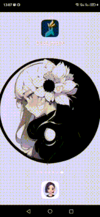
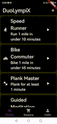
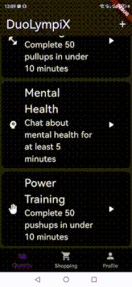
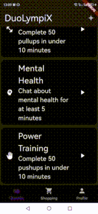
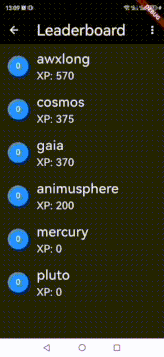
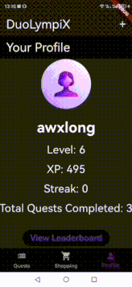
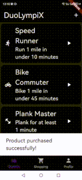

 

# DuoLympiX: App for gamifying life

DuoLympiX is an app which supports the pursuit of a healthy lifestyle via gamifying the process of exercising physically and mentally.  

It is coded with Dart which supports iOS and Android cross-platform compilation. It has the following features:
## 1. User authentification. Complete a quest via customized monitoring and socialize



Complete a quest, e.g. run a mile in under 10 minutes monitored via a distance tracker and timer, to earn XP and chat with others doing the same quest. 

## 2. Mental health quests supported via conversations with an LLM



### Details about chatbot

DuoLympiX currently uses quantized deepseek-r1 with custom prompt-engineering depending on the quest to hold conversations with the user. The chatbot is currently hosted locally via ollama (thus changes are needed if deployed on production). To try it yourself, you need to download and install ollama and host it with the following commands:
```
# Set _baseUrl in chat_repository.dart to your host's IP address, with default 11434 port
export OLLAMA_HOST="0.0.0.0:11434" # enables Ollama to listen to all devices
ollama serve
ollama run deepseek-r1:8b 
```

Since deepseek-r1 outputs its 'thought process' before giving an answer, our conversation interface enables reading the thoughts also. 
## 3. Community posting


Community-based features of the app are inspired by the [Yoobingo 达目标 app](http://www.yoobingo.com/). This includes posting comments in a public forum per quest to share tips, words of encouragement, discussions, among others. 

## 4. User profile and leaderboard



DuoLympiX has a database which stores user information such as XP earned, which can be compared within a leaderboard to track progress.  

## 5. XP investment system



Another community-based feature inspired by [Yoobingo 达目标](http://www.yoobingo.com/) is the ability to invest your XP in friends to encourage each other to complete a quest. Investing XP deducts your own and increases the original XP value of a quest which one believes is best for a friend. 

## 6. Shopping system 



Earning XP enables a user to level up. In addition to that, XP can be exchanged for products which improve one's health. The **future vision is that XP can be exchanged for tangible goods** to further encourage completing physical and mental health quests which improve a person's health.  

## 7. Custom-design quests 



DuoLympiX enables users to custom design quests. There at least $3$ different types of quests:
- distance-based quests which enable distance tracking 
- mental health quests which enable the user to custom prompt-engineer the LLM for a conversation
- strength-based quests which only has a timer 

## Future extensions

DuoLympiX has several extensions which can be implemented to further support the pursuit of a healthy lifestyle. For example,  
- Monitor biomarkers and connect with digital health devices, which both enable more diverse quests (e.g. do aerobic exercise for 10 minutes tracking cardiac activity) and more thorough monitoring of a user's health.

- As mentioned before, a future vision is to link the app to a real shop for purchasing tangible products which can advance a healthy lifestyle and can be delivered to you. 

We are **more than happy to welcome any contributions which can improve the app in any aspect**. To do so, feel free to open a pull request. To run the app yourself, please:

1. `git clone https://github.com/awxlong/duolympix`
2. As mentioned before, install ollama and host the LLM with the appropriate IP address.
3. Inside `lib/main.dart`, you can select a virtual device and run the app (`flutter pub get; flutter run`)

Feel free to read the app's documentation inside `doc/api` about classes, widgets and methods defined. 

## Build the .apk for Android

`flutter build apk --release` 

